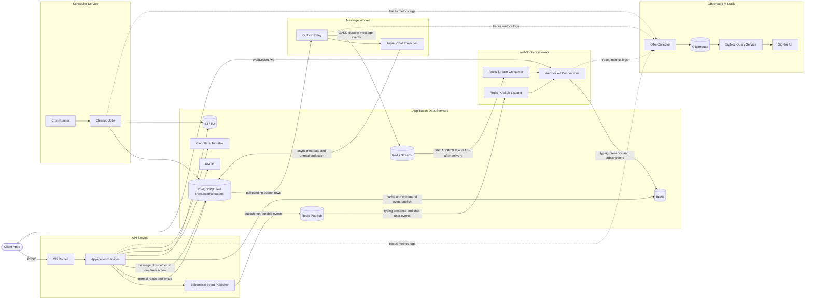
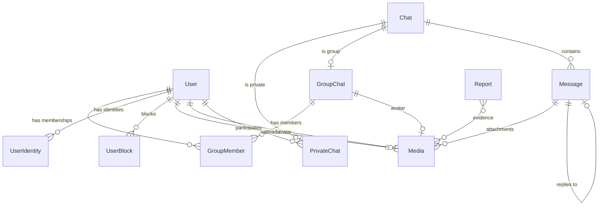

# Atoi-Talk-API

RESTful API and event-driven services for real-time chat applications. Handles authentication, private/group messaging, media uploads, durable event production, and background cleanup jobs. WebSocket connections are served by the separate WebSocket Gateway. Built with Go, PostgreSQL, Redis, and S3-compatible storage.

See [Atoi-Talk](https://github.com/Hilmi-Raif/Atoi-Talk) for an example frontend.

## Architecture

The system runs as separate API, message-worker, websocket-gateway, and scheduler services sharing the same codebase and PostgreSQL source of truth:



**API service** handles REST endpoints and transactional business operations. WebSocket connections are served only by the separate `websocket-gateway` service.

**Message worker** claims transactional outbox rows, updates asynchronous chat projections, and publishes durable message events to Redis Streams. PostgreSQL remains the source of truth; polling is always available as a fallback.

**WebSocket gateway** owns WebSocket connections on `REALTIME_PORT` (local default `8081`). It consumes durable message events from Redis Streams and ephemeral events from Redis Pub/Sub. Production ingress should route `/ws` to this service.

**Scheduler service** runs periodic cleanup jobs in the background. Hard-deletes expired soft-deleted entities, removes orphaned media from S3, and garbage-collects abandoned private chats. Deliberately skips database migrations to avoid race conditions with the API.

### Event-Driven Flow

Durable message events use the transactional outbox pattern. The API stores the message and its outbox record in the same PostgreSQL transaction. The message worker polls eligible outbox records, applies asynchronous chat metadata and unread projections, then publishes targeted events to the `events:messages` Redis Stream. The WebSocket Gateway consumes the stream with a per-instance consumer group and acknowledges an event only after it has been delivered to local connections.

Redis Streams provide buffering, consumer groups, pending-entry recovery, and at-least-once delivery for message events. Consumers use stable event identifiers and bounded deduplication because a worker or gateway can crash after publishing or before acknowledging an event. PostgreSQL remains the durable source of truth and the outbox is retried when Redis is unavailable.

Ephemeral events such as typing, presence, and non-durable chat or user updates use the `events:broadcast` Redis Pub/Sub channel. These events are intentionally best-effort and are not used as the durable message delivery path. Clients can recover missed durable messages from PostgreSQL-backed history after reconnecting.

### Observability Flow

The API, message worker, WebSocket Gateway, and scheduler export traces, metrics, and structured logs through OpenTelemetry Protocol. The local stack sends this telemetry to the OTel Collector, which stores trace and metric data in ClickHouse for SigNoz Query Service and the SigNoz UI.

The telemetry covers HTTP latency and active requests, PostgreSQL query and pool behavior, Redis commands and Stream consumer state, S3 calls, outbox backlog, worker processing stages, WebSocket delivery, health checks, and scheduler jobs. SQL text, SQL parameters, Redis keys, message content, and file names are excluded from telemetry attributes.

## Data Model



## Features

### Auth & Accounts

- Email/password registration with OTP email verification
- Google OAuth login
- JWT-based session management with token blacklisting
- Password reset via OTP
- Cloudflare Turnstile captcha on sensitive endpoints
- Account deletion (soft delete with configurable retention)

### Messaging

- Private 1-on-1 chats
- Group chats with roles (owner, admin, member)
- Text messages with file/image attachments
- Message editing and deletion
- Read receipts and unread counts
- Chat delete

### Groups

- Public and private groups
- Invite links with reset capability
- Member management (kick, role changes, ownership transfer)
- Group dissolution
- Searchable public group directory

### Real-Time

- WebSocket connection with JWT auth
- Events: `message.new`, `message.update`, `message.delete`, `chat.new`, `chat.read`, `chat.typing`, `user.online`, `user.offline`, `user.update`, `user.block`, `user.banned`, `user.deleted`, and more
- Redis Streams for durable message delivery and Redis Pub/Sub for ephemeral events such as typing and presence
- Online presence tracking with TTL-based keepalive

### Media

- File upload to S3-compatible storage (tested with Cloudflare R2)
- Public and private buckets
- Presigned URLs for private file access
- Orphan media cleanup by scheduler

### Admin

- Dashboard stats
- User management (view, ban, unban, reset profile)
- Group management (view, dissolve, reset info)
- Report system (view, resolve, delete)

### Scheduler Jobs

- **Entity cleanup**: hard-deletes users and chats past the soft-delete retention period
- **Private chat GC**: removes abandoned private chats where both users are gone
- **Media cleanup**: deletes orphaned files from S3 and database

## Tech Stack

| Layer | Technology |
|---|---|
| Language | Go 1.25 |
| Router | Chi v5 |
| ORM | Ent |
| Database | PostgreSQL |
| Cache / PubSub / Streams | Redis |
| Storage | S3 (Cloudflare R2) |
| Auth | JWT, Google OAuth2, bcrypt |
| WebSocket | gorilla/websocket |
| Validation | go-playground/validator |
| Email | SMTP (Mailpit or Mailtrap for dev) |
| Scheduler | robfig/cron |
| Docs | Swagger (swag), AsyncAPI |
| Captcha | Cloudflare Turnstile |

## Project Structure

```
cmd/
├── api/                 # API server entrypoint
├── message_worker/      # Transactional outbox and message projection worker
├── websocket_gateway/   # WebSocket gateway and event consumers
└── scheduler/           # Scheduler entrypoint

internal/
├── api/
│   ├── http/          # controllers, middleware, routes, and response writers
│   └── application/   # feature-oriented application services
├── bootstrap/         # dependency wiring
├── domain/            # shared constants, DTOs, and domain helpers
├── infrastructure/
│   ├── database/      # Ent, repositories, and response mappers
│   ├── redis/         # Redis cache, Pub/Sub, and Streams
│   ├── object_storage/
│   ├── email/
│   ├── captcha/
│   ├── config/
│   └── observability/
├── messaging/
│   ├── events/        # shared event contracts
│   ├── outbox/        # atomic outbox helpers
│   └── message_worker/ # durable event relay and projections
├── scheduler/
│   └── job/            # individual cleanup jobs
└── websocket_gateway/  # WebSocket connections and event consumers

ent/
└── schema/           # Database schema definitions

docs/                 # Generated Swagger + AsyncAPI specs
deployments/          # Docker compose and environment configurations
├── local/            # Local development compose and env template
├── integration/      # Local integration test backing services
└── observability/    # Standalone SigNoz observability stack
integration/          # Integration test suite (*_test.go, requires -tags=integration)
```

## Getting Started

### Releases

Release Please manages versioning and `CHANGELOG.md` from Conventional Commits on `main`. It creates a release pull request for review. After the release pull request is merged, the workflow creates the GitHub Release and publishes the API, message-worker, WebSocket Gateway, and scheduler images to GHCR.

Commit types that create releases:

| Commit | Release |
|---|---|
| `fix(scope): ...` | patch |
| `feat(scope): ...` | minor |
| `feat(scope)!: ...` | major |

Release images use the version, `latest`, and immutable SHA tags. Release Please does not require Node.js or `package.json` in this Go repository.

### Prerequisites

- Go 1.25+
- PostgreSQL
- Redis
- S3-compatible storage with public and private buckets for media operations

### Setup

1. Clone the repo:

```bash
git clone https://github.com/Hilmi-Raif/Atoi-Talk-API.git
cd Atoi-Talk-API
```

2. Choose a runtime mode.

For the complete Docker Compose stack, use the local template. It contains container network addresses, local buckets, and the OpenTelemetry defaults used by the Compose services:

```bash
cp deployments/local/.env.example .env
docker compose -f deployments/local/docker-compose.yaml --env-file .env up -d --build
docker compose -f deployments/observability/docker-compose.yaml up -d
```

This mode starts the API, message worker, WebSocket Gateway, scheduler, backing services, and observability stack. No separate `go run` commands are required.

For native Go processes, use the root template and update `.env` to use host-accessible ports before starting the dependencies:

```bash
cp .env.example .env
```

Set at least these values in the native `.env`:

```dotenv
DB_HOST=localhost
DB_PORT=5434
S3_ENDPOINT=http://localhost:9090
S3_PRESIGN_ENDPOINT=http://localhost:9090
SMTP_HOST=localhost
SMTP_PORT=1025
S3_BUCKET_PUBLIC=public-bucket
S3_BUCKET_PRIVATE=private-bucket
```

The `5434` database port is the host port published by the local dependency Compose file when using this native setup. The application processes still connect to PostgreSQL's container port when they run inside Compose.

3. Install dependencies for native mode:

```bash
go mod download
```

4. Start the required dependencies when running the Go processes natively:

```bash
docker compose -f deployments/local/docker-compose.yaml --env-file .env up -d postgres redis s3mock mailpit
```

Skip steps 3 through 8 when using the complete Docker Compose mode.

5. Run the API:

```bash
go run cmd/api/main.go
```

6. Run the message worker (separate terminal):

```bash
go run cmd/message_worker/main.go
```

7. Run the WebSocket Gateway (separate terminal):

```bash
go run cmd/websocket_gateway/main.go
```

8. Run the scheduler (separate terminal):

```bash
go run cmd/scheduler/main.go
```

### Docker

Build and run each service separately:

```bash
# API
docker build -f build/package/api/Dockerfile -t atoitalk-api .
docker run --env-file .env -p 8080:8080 atoitalk-api

# Scheduler
docker build -f build/package/scheduler/Dockerfile -t atoitalk-scheduler .
docker run --env-file .env atoitalk-scheduler

# Message worker
docker build -f build/package/message_worker/Dockerfile -t atoitalk-message-worker .
docker run --env-file .env atoitalk-message-worker

# WebSocket Gateway
docker build -f build/package/websocket_gateway/Dockerfile -t atoitalk-websocket-gateway .
docker run --env-file .env -p 8081:8081 atoitalk-websocket-gateway
```

Run the complete local stack with Docker Compose:

```bash
docker compose -f deployments/local/docker-compose.yaml --env-file .env up -d --build
```

The API listens on `http://localhost:8080` and the WebSocket Gateway listens on `http://localhost:8081`.

## Environment Variables

Copy `.env.example` to `.env` and fill in the values. Only the API runs database migrations from `DB_MIGRATE`; the message worker, WebSocket Gateway, and scheduler disable migrations when they start.

### `.env` — Runtime Config

#### Shared Runtime Settings

The API, message worker, WebSocket Gateway, and scheduler share database and Redis connectivity. The tables below separate process-wide settings from process-specific settings.

The native default for `DB_PORT` is `5432`. The local dependency Compose file publishes PostgreSQL on host port `5434`, so native processes use `DB_PORT=5434` when connecting to that stack.

| Variable | Description | Default |
|---|---|---|
| `APP_ENV` | `development` or `production` (controls log format) | `development` |
| `DB_HOST` | PostgreSQL host | `localhost` |
| `DB_PORT` | PostgreSQL port | `5432` |
| `DB_USER` | Database user | `postgres` |
| `DB_PASSWORD` | Database password | `postgres` |
| `DB_NAME` | Database name | `atoitalk` |
| `DB_SSLMODE` | SSL mode (`disable`, `require`, etc.) | `disable` |
| `DB_MAX_OPEN_CONNS` | Maximum database connections for the process | `80` |
| `DB_MAX_IDLE_CONNS` | Maximum idle database connections for the process | `40` |
| `DB_CONN_MAX_LIFETIME` | Maximum lifetime of a database connection | `30m` |
| `DB_CONN_MAX_IDLE_TIME` | Maximum idle time for a database connection | `5m` |

#### API Only

| Variable | Description | Default |
|---|---|---|
| `APP_PORT` | HTTP server port | `8080` |
| `APP_URL` | Base URL of the API | `http://localhost:8080` |
| `APP_CORS_ALLOWED_ORIGINS` | Allowed CORS origins | `*` |
| `RATE_LIMIT_ENABLED` | Enables rate limiting middleware | `true` |
| `CAPTCHA_ENABLED` | Enables Cloudflare Turnstile captcha verification | `true` |
| `DB_MIGRATE` | Run schema migrations on startup | `false` |
| `GOOGLE_CLIENT_ID` | Google OAuth client ID | — |
| `GOOGLE_CLIENT_SECRET` | Google OAuth client secret | — |
| `GOOGLE_REDIRECT_URL` | Google OAuth redirect URL | — |
| `JWT_SECRET` | JWT signing key | `secret` |
| `JWT_EXP` | JWT expiration in seconds | `86400` |
| `TURNSTILE_SECRET_KEY` | Cloudflare Turnstile secret | — |
| `OTP_EXP` | OTP expiration in seconds | `300` |
| `OTP_RATE_LIMIT_SECONDS` | OTP rate limit window | `60` |
| `OTP_SECRET` | OTP signing secret | `secret` |
| `ENABLE_PPROF` | Expose `/debug/pprof/*` diagnostic endpoints | `false` |

#### Shared S3 Settings

| Variable | Description | Default |
|---|---|---|
| `S3_BUCKET_PUBLIC` | Public S3 bucket name | — |
| `S3_BUCKET_PRIVATE` | Private S3 bucket name | — |

All processes load these bucket names from the shared configuration. The WebSocket Gateway only needs the names for its runtime configuration and does not make S3 requests.

#### API, Scheduler, and Message Worker S3 Settings

| Variable | Description | Default |
|---|---|---|
| `S3_REGION` | S3 region | — |
| `S3_ACCESS_KEY` | S3 access key | — |
| `S3_SECRET_KEY` | S3 secret key | — |
| `S3_ENDPOINT` | S3 endpoint URL | — |
| `S3_PRESIGN_ENDPOINT` | Endpoint used in generated presigned URLs | — |
| `S3_PUBLIC_DOMAIN` | CDN domain for public bucket | — |

#### Shared Observability Settings

These settings apply to the API, message worker, WebSocket Gateway, and scheduler.

| Variable | Description | Default |
|---|---|---|
| `OTEL_ENABLED` | Enable OpenTelemetry tracing and metrics | `false` |
| `OTEL_SERVICE_NAME` | Base service name in telemetry | `atoitalk-api` |
| `OTEL_SERVICE_VERSION` | Service version in telemetry | `0.1.1` |
| `OTEL_EXPORTER_OTLP_ENDPOINT` | OTLP gRPC collector endpoint | `localhost:4317` |
| `OTEL_EXPORTER_OTLP_INSECURE` | Use plaintext gRPC for OTLP | `true` |
| `OTEL_SAMPLING_RATIO` | Trace sampling fraction from 0.0 to 1.0 | `0.1` |
| `OTEL_METRIC_EXPORT_INTERVAL` | Interval for metric reader collection and export | `5s` |

#### SMTP Settings

| Variable | Description | Default |
|---|---|---|
| `SMTP_HOST` | SMTP server host | — |
| `SMTP_PORT` | SMTP port | `587` |
| `SMTP_USER` | SMTP username | — |
| `SMTP_PASSWORD` | SMTP password | — |
| `SMTP_FROM_EMAIL` | Sender email address | — |
| `SMTP_FROM_NAME` | Sender display name | — |
| `SMTP_ASYNC` | Send emails asynchronously | `true` |

#### Shared Redis Settings

These settings are used by the API, message worker, and WebSocket Gateway.

| Variable | Description | Default |
|---|---|---|
| `REDIS_HOST` | Redis host | `localhost` |
| `REDIS_PORT` | Redis port | `6379` |
| `REDIS_PASSWORD` | Redis password | — |
| `REDIS_DB` | Redis database number | `0` |

#### Scheduler Only

| Variable | Description | Default |
|---|---|---|
| `SOFT_DELETE_RETENTION_DAYS` | Days before hard-deleting soft-deleted entities | `30` |
| `MEDIA_RETENTION_DAYS` | Days before cleaning orphan media (supports decimals) | `7` |
| `ENTITY_CLEANUP_CRON` | Cron schedule for entity cleanup | `0 2 * * *` |
| `PRIVATE_CHAT_CLEANUP_CRON` | Cron schedule for private chat GC | `30 2 * * *` |
| `MEDIA_CLEANUP_CRON` | Cron schedule for media cleanup | `0 3 * * *` |

#### Message Worker Only

| Variable | Description | Default |
|---|---|---:|
| `MESSAGE_WORKER_BATCH_SIZE` | Maximum outbox records claimed per batch | `100` |
| `MESSAGE_WORKER_CONCURRENCY` | Maximum records processed concurrently | `5` |
| `MESSAGE_WORKER_LEASE_DURATION` | Duration of an outbox claim lease | `5m` |
| `MESSAGE_WORKER_POLL_INTERVAL` | Polling interval for pending outbox records | `1s` |
| `MESSAGE_WORKER_BACKLOG_INTERVAL` | Interval for backlog metrics | `5s` |
| `MESSAGE_EVENT_STREAM` | Redis Stream used for durable message events | `events:messages` |
| `MESSAGE_EVENT_STREAM_MAX_LEN` | Approximate maximum Redis Stream length | `10000` |

#### WebSocket Gateway Only

| Variable | Description | Default |
|---|---|---:|
| `REALTIME_PORT` | WebSocket Gateway HTTP port | `8081` |
| `REALTIME_INSTANCE_ID` | Unique gateway instance identifier | `realtime-1` |
| `REALTIME_CONSUMER_GROUP` | Optional Redis Stream consumer group override | derived from instance ID |

### `.env.test` — Test Config

Copy `deployments/integration/.env.example` to `deployments/integration/.env.test`. Uses a separate database and Redis DB to avoid polluting real data.

| Variable | Description | Default |
|---|---|---|
| `DB_HOST` | Test database host | `localhost` |
| `DB_PORT` | Test database port | `5433` |
| `DB_USER` | Test database user | `postgres` |
| `DB_PASSWORD` | Test database password | `postgres` |
| `DB_NAME` | Test database name | `atoitalk_test` |
| `DB_SSLMODE` | SSL mode | `disable` |
| `REDIS_HOST` | Test Redis host | `localhost` |
| `REDIS_PORT` | Test Redis port | `6379` |
| `REDIS_PASSWORD` | Test Redis password | — |
| `REDIS_DB` | Test Redis DB (use different from prod) | `1` |
| `GOOGLE_CLIENT_ID` | Placeholder for tests | `test` |
| `GOOGLE_CLIENT_SECRET` | Placeholder for tests | `test` |
| `GOOGLE_REDIRECT_URL` | Placeholder for tests | `test` |
| `S3_*` | S3 config (same keys as runtime) | — |
| `SMTP_*` | SMTP config (same keys as runtime) | — |
| `TEST_GOOGLE_AUTH_CODE` | Google auth code for integration tests | — |

## API Docs

Full documentation is available [here](https://doc-atoitalk-api.netlify.app/). Raw specs are in `docs/swagger.json` and `docs/asyncapi.yaml`.

## Observability

When enabled, the API, message worker, WebSocket Gateway, and scheduler export traces, metrics, and correlated structured logs through OpenTelemetry Protocol. The local observability stack uses an OTel Collector, SigNoz Query Service, and ClickHouse.

The telemetry covers HTTP latency and active requests, PostgreSQL query and pool behavior, Redis commands and Stream consumer state, S3 calls, outbox backlog, worker processing stages, WebSocket delivery, health checks, and scheduler jobs. SQL text, SQL parameters, Redis keys, message content, and file names are excluded from telemetry attributes.

Start the local application and observability stacks:

```bash
make local-up
make observability-up
```

Open SigNoz at `http://localhost:3301` after starting telemetry. Each process reports its own service identity through `OTEL_SERVICE_NAME`; the worker, gateway, and scheduler append their process suffixes to the configured base name.

The importable live dashboard is `deployments/observability/dashboards/atoitalk-benchmark.json`. The SigNoz Query Service provisions this file automatically from `DASHBOARDS_PATH` when the observability stack starts. If the Query Service was already running before the file was added, recreate only that service:

```bash
docker compose -f deployments/observability/docker-compose.yaml up -d --force-recreate signoz-query-service
```

The dashboard reads current metrics instead of embedding a benchmark snapshot. Redis Stream pending entries and lag are not included as a fabricated metric; validate them with `XINFO GROUPS` for the configured stream and consumer group.

## Performance Validation

The reference benchmarks evaluate performance using the k6 `constant-arrival-rate` executor with **native k6 on the Windows host**. The API stack and its dependencies run in WSL2 Docker, with SigNoz enabled and `OTEL_SAMPLING_RATIO=0.1`. Each endpoint was tested independently so one workload could not affect another.

Test profile:

- Target: `500 RPS`
- Measurement duration: `60s` per run
- Pre-allocated VUs: `100` (auto-scaling up to `900` max VUs)
- Warmup: 10s connection pool warmup before measurement window
- Fixture: reset and `VACUUM (ANALYZE)` before each run
- Success criteria: zero dropped iterations, P95 `<500ms`, P99 `<1s`, and application errors `<1%`

### Endpoint summary

The table reports the completed iterations, dropped iterations, latency percentiles (P95/P99), application errors, and maximum active VUs under 500 RPS sustained load.

| Endpoint | Completed | Dropped | P95 Latency | P99 Latency | App errors | Max VUs | Result |
|---|---:|---:|---:|---:|---:|---:|---|
| `GET /api/users` | 30,001 | 0 | 2.79 ms | 3.49 ms | 0.00% | 2 | Pass |
| `POST /api/media/upload` | 30,001 | 0 | 3.00 ms | 3.97 ms | 0.00% | 2 | Pass |
| `GET /api/chats` | 30,001 | 0 | 7.99 ms | 14.99 ms | 0.00% | 5 | Pass |
| `GET /api/chats/:id/messages` | 30,000 | 0 | 9.00 ms | 14.81 ms | 0.00% | 6 | Pass |
| `GET /api/chats/:id/messages/around` | 30,000 | 0 | 9.99 ms | 15.00 ms | 0.00% | 9 | Pass |
| `POST /api/messages` | 30,001 | 0 | 16.99 ms | 29.00 ms | 0.00% | 15 | Pass |

All isolated endpoints achieved a 100% pass rate under 500 RPS sustained load with 0 dropped iterations and 0.00% application errors. Latency percentiles across all endpoints remained well beneath target thresholds (all P95 < 17ms vs 500ms target, all P99 < 30ms vs 1000ms target). Active virtual user requirements remained exceptionally low (2 to 15 VUs across all endpoints), demonstrating excellent query efficiency and absence of database connection pool contention.


### Resource usage

k6 ran natively on the host and is excluded from application resource totals. Resource reporting therefore separates the application stack from observability services and treats the load generator as a separate host workload.

| Scope | CPU average | Memory average | Interpretation |
|---|---:|---:|---|
| Application services | 350.86% | 818.53 MiB | API, database, cache, workers, gateway, and supporting services |
| Observability services | 82.79% | 2,043.68 MiB | SigNoz, ClickHouse, collector, and related services |

These values are a synchronized resource reference from the same general workload profile, not a per-endpoint measurement or a sizing requirement. CPU percentages are relative to one logical CPU; individual peaks are not additive. Actual usage varies with traffic mix, data volume, sampling, runtime limits, and deployment topology.

Run an isolated endpoint benchmark:

```bash
make loadtest-api-endpoint ENDPOINT=chats TARGET_RPS=500 DURATION=60s MAX_VUS=900
make loadtest-api-endpoint ENDPOINT=messages TARGET_RPS=500 DURATION=60s MAX_VUS=900
make loadtest-api-endpoint ENDPOINT=around TARGET_RPS=500 DURATION=60s MAX_VUS=900 CHAT_IDS=00000000-0000-0000-0000-000000000001 AROUND_MESSAGE_ID=00000000-0000-0000-0020-000000000001
make loadtest-api-endpoint ENDPOINT=send TARGET_RPS=500 DURATION=60s MAX_VUS=900 CHAT_IDS=00000000-0000-0000-0000-000000000001
make loadtest-api-endpoint ENDPOINT=users TARGET_RPS=500 DURATION=60s MAX_VUS=900
make loadtest-api-endpoint ENDPOINT=media TARGET_RPS=500 DURATION=60s MAX_VUS=900
make loadtest-ws
```

Before comparing write runs, verify that the outbox and Redis Stream consumer group have returned to zero backlog. Raw k6 summary files are intentionally excluded from version control because authentication data can be present in them. Deterministic database fixtures can be restored anytime before running benchmarks via `make loadtest-reset`.

## Development & Makefile

```bash
# Show available commands
make help

# Format and static analysis
make fmt
make vet
make lint
make security

# Code and mock generation
make generate
make mock-verify

# Run unit tests
make test
make test-race
make coverage-unit
make coverage-check

# Run integration tests with local backing services
make test-env-up
cp deployments/integration/.env.example deployments/integration/.env.test
make test-integration
make test-env-down

The local integration services are defined in `deployments/integration/docker-compose.yaml`.

# Start full local application stack (API, Message Worker, WebSocket Gateway, Scheduler, DB, Redis, S3Mock, Mailpit)
make local-up
# Or run with SigNoz observability overlay:
make local-observability-up
make local-observability-down

# Start standalone SigNoz observability stack (OpenTelemetry, ClickHouse, Dashboard)
make observability-up
# Open SigNoz UI at http://localhost:3301
make observability-down

# Build binaries and docker images
make build-api
make build-message-worker
make build-websocket-gateway
make build-scheduler
make docker-build
```

## Tests

```bash
# Unit tests
make test

# Unit tests with race detector
make test-race

# Integration tests
make test-env-up
make test-integration
make test-env-down

# Static analysis
make vet
make lint
```
